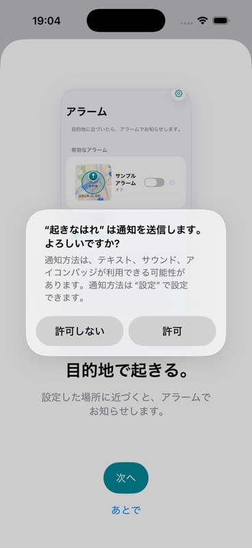
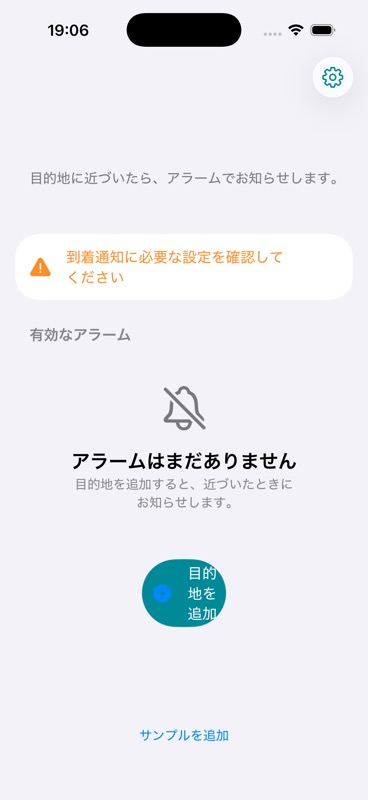
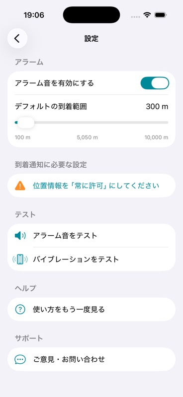
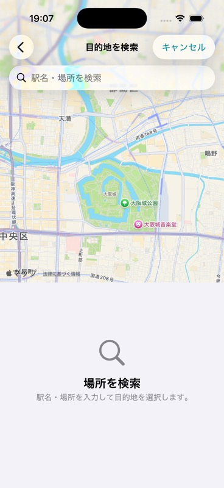
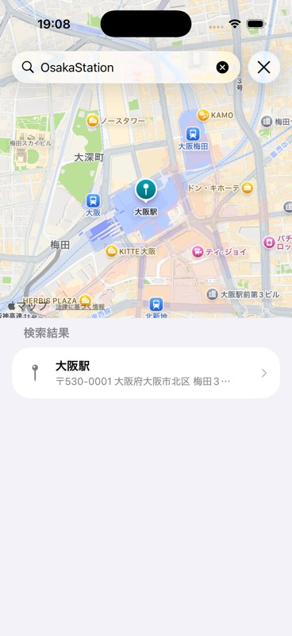
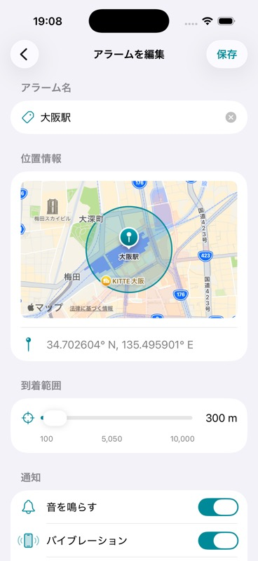
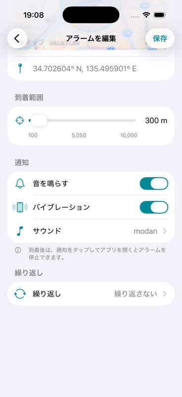

# Apple純正アプリを基準にしたUI/UX・不具合監査

監査日: 2026-07-23  
対象: `locationwake` / iPhone 17 / iOS 26.5 Simulator  
監査方法: SwiftUIコードの静的確認、主要フローの実操作、画面撮影、ビルド、テスト、Apple Human Interface Guidelinesとの比較

## 結論

見た目の骨格はApple純正アプリにかなり近づいています。`NavigationStack`、`List`、`Form`、`Section`、`Map`、`searchable`、標準の`Toggle`・`Slider`・`ContentUnavailableView`を中心に構成し、SF Symbolsとシステム背景色も活用できています。

一方、純正アプリらしさを決める「予測可能な挙動」「失敗からの回復」「アクセシビリティ」「主要機能への信頼」は未完成です。特に到着を取り逃す経路、停止できないアラーム、初回許可の順序、編集で意図せず再有効化される問題は、見た目より先に直す必要があります。

今回の監査評価:

| 観点 | 評価 | 要約 |
|---|---:|---|
| 視覚・標準部品 | 7/10 | 標準部品中心で、設定・検索・詳細はかなりiOSらしい |
| 操作の一貫性 | 5/10 | pushと保存・キャンセルの考え方、設定名と効果にずれがある |
| アクセシビリティ | 4/10 | 基盤はあるが、Dynamic Type・VoiceOver・コントラストに重大リスク |
| 主要機能の信頼性 | 4/10 | 到着検知の取り逃しと停止経路に重大な問題がある |

## 実際に確認したフロー

### 1. 初回起動・オンボーディング — 要改善

オンボーディング自体は目的と効果を短く伝えていますが、その最中に通知許可が割り込みます。Appleは、必要性を説明した文脈の中で権限を求めることを推奨しています。

### 2. アラーム一覧・空状態 — 要修正

`ContentUnavailableView`の採用は適切です。ただし主ボタン「目的地を追加」が狭く圧縮され、4行に折り返されて円形に見えます。標準部品を使っていても、この崩れは純正品質から外れます。

### 3. 設定 — おおむね良好

`Form`、`Section`、`Toggle`、`Slider`の使い方は自然です。一方、100〜10,000mの線形Sliderは通常利用域の300mが端に寄り、中央表示の5,050mも判断材料として弱いため、段階式Pickerまたは非線形Sliderが適します。

### 4. 目的地検索・初期状態 — 良好

Map、検索欄、空状態はiOSらしくまとまっています。ただしpush画面で標準の戻ると「キャンセル」が重複しています。

### 5. 目的地検索・結果 — 良好

地図と結果の連動、結果行の見た目は明快です。ただし検索中・0件・失敗状態がなく、古い非同期検索結果が新しい結果を上書きする可能性があります。

### 6. 新規アラーム詳細・上部 — おおむね良好

地図、目的地、到着範囲の階層は分かりやすいです。ただし新規作成でもタイトルが「アラームを編集」であり、push画面なのに右上保存を要求する設計は操作モデルが曖昧です。

### 7. 新規アラーム詳細・通知設定 — おおむね良好

標準Toggleと行遷移は自然です。末尾の大きな空白、設定内容と実際のバックグラウンド保証の差、VoiceOver上の選択状態不足は改善が必要です。

## できている点

- `NavigationStack`、`List`、`Form`、`Section`、`ToolbarItem`、`ContentUnavailableView`、`searchable`、`Map`を中心に構成している。
- `.primary`、`.secondary`、system background、SF Symbolsを多く使い、ライト・ダーク両対応の土台がある。
- 空状態、設定不足の警告、削除メニュー、通知・音・振動など、ユーザーが状態を把握するための要素がある。
- 装飾画像や一覧内の地図を一部VoiceOverから除外し、歯車・保存・試聴にはラベルを付けている。
- アラームIDの正規化、保存データの移行、ジオフェンスの差分同期にはテストがあり、設計意図も明確。

## 最優先: 主要機能の不具合リスク

### P0-1. 保存直後に目的地へ入ると到着を取り逃す

現状: 保存後10秒以内の`didEnterRegion`を破棄し、その後に再評価しません。進入イベントは一度しか来ないため、退出・再進入まで鳴らない可能性があります。

原因:

- [AlarmDetailView.swift:240](/Users/inoueharuto/Library/CloudStorage/OneDrive-KansaiUniversity/locationwake/locationwake/SwiftUIView/AlarmDetailView.swift:240)
- [LocationManager.swift:292](/Users/inoueharuto/Library/CloudStorage/OneDrive-KansaiUniversity/locationwake/locationwake/Helpers/LocationManager.swift:292)
- [LocationManager.swift:350](/Users/inoueharuto/Library/CloudStorage/OneDrive-KansaiUniversity/locationwake/locationwake/Helpers/LocationManager.swift:350)

改善: 抑止中の進入を保留し、10秒後に領域状態または現在位置を必ず再評価します。

### P0-2. 監視登録時にすでに領域内だと鳴らない場合がある

現状: キャッシュ位置がnil・古い・精度不足なら即時判定を中止しますが、監視開始後の領域状態を問い合わせません。

原因:

- [LocationManager.swift:169](/Users/inoueharuto/Library/CloudStorage/OneDrive-KansaiUniversity/locationwake/locationwake/Helpers/LocationManager.swift:169)
- [LocationManager.swift:323](/Users/inoueharuto/Library/CloudStorage/OneDrive-KansaiUniversity/locationwake/locationwake/Helpers/LocationManager.swift:323)
- [LocationManager.swift:540](/Users/inoueharuto/Library/CloudStorage/OneDrive-KansaiUniversity/locationwake/locationwake/Helpers/LocationManager.swift:540)

改善: `didStartMonitoringFor`後に領域状態を問い合わせるか、一時的な位置取得で初期状態を確定します。

### P0-3. フォアグラウンドで鳴ると停止UIがない

現状: 音は無限ループ、振動は実質無限反復ですが、停止処理は通知タップまたはscene activationに依存します。アプリを表示中に通知を見逃すと、画面から止められません。

原因:

- [SoundPlayer.swift:55](/Users/inoueharuto/Library/CloudStorage/OneDrive-KansaiUniversity/locationwake/locationwake/Service/SoundPlayer.swift:55)
- [LocationManager.swift:395](/Users/inoueharuto/Library/CloudStorage/OneDrive-KansaiUniversity/locationwake/locationwake/Helpers/LocationManager.swift:395)
- [AppDelegate.swift:77](/Users/inoueharuto/Library/CloudStorage/OneDrive-KansaiUniversity/locationwake/locationwake/AppDelegate.swift:77)

改善: 発火中アラームを単一の状態として管理し、必ず「停止」画面を表示します。安全用の最大継続時間も設けます。

### P0-4. 「振動のみ」はバックグラウンドで反復を保証できない

現状: 振動は`Timer`依存で、バックグラウンド実行猶予が終わると止まります。通知音もnilなので、設定名から期待する動作と一致しません。

原因:

- [LocationManager.swift:389](/Users/inoueharuto/Library/CloudStorage/OneDrive-KansaiUniversity/locationwake/locationwake/Helpers/LocationManager.swift:389)
- [HapticManager.swift:48](/Users/inoueharuto/Library/CloudStorage/OneDrive-KansaiUniversity/locationwake/locationwake/Service/HapticManager.swift:48)
- [AlarmScheduler.swift:15](/Users/inoueharuto/Library/CloudStorage/OneDrive-KansaiUniversity/locationwake/locationwake/Service/AlarmScheduler.swift:15)

改善: iOSが保証するローカル通知の仕様に寄せ、UIにも保証範囲を正確に表示します。

### P0-5. 対象外曜日に領域へ入り、領域内で日付を跨ぐと取り逃し得る

現状: 対象曜日への変化は位置更新時にしか再評価されません。自動停止で更新が止まると鳴りません。

原因:

- [LocationManager.swift:297](/Users/inoueharuto/Library/CloudStorage/OneDrive-KansaiUniversity/locationwake/locationwake/Helpers/LocationManager.swift:297)
- [LocationManager.swift:441](/Users/inoueharuto/Library/CloudStorage/OneDrive-KansaiUniversity/locationwake/locationwake/Helpers/LocationManager.swift:441)

改善: 領域内状態を保存し、日付変更・アプリ復帰・利用可能なバックグラウンド機会で再判定します。

## 高優先度: UI/UXと状態設計

### P1-1. 権限要求が説明より先に出る

現状: 起動時にATTを要求し、`LocationManager`初期化時に通知許可を要求します。オンボーディングは一覧表示後です。

原因:

- [AppDelegate.swift:39](/Users/inoueharuto/Library/CloudStorage/OneDrive-KansaiUniversity/locationwake/locationwake/AppDelegate.swift:39)
- [LocationManager.swift:114](/Users/inoueharuto/Library/CloudStorage/OneDrive-KansaiUniversity/locationwake/locationwake/Helpers/LocationManager.swift:114)
- [AlarmListSwiftUIView.swift:220](/Users/inoueharuto/Library/CloudStorage/OneDrive-KansaiUniversity/locationwake/locationwake/SwiftUIView/AlarmListSwiftUIView.swift:220)

改善: 通知・位置情報・ATTを一括で起動時に求めず、それぞれの利用価値を説明した直後に要求します。

### P1-2. オンボーディング未完了でも既読になる

現状: シート表示時点で`hasSeenOnboarding = true`にします。スワイプ終了や途中離脱でも次回表示されません。

原因:

- [AlarmListSwiftUIView.swift:222](/Users/inoueharuto/Library/CloudStorage/OneDrive-KansaiUniversity/locationwake/locationwake/SwiftUIView/AlarmListSwiftUIView.swift:222)
- [OnboardingView.swift:53](/Users/inoueharuto/Library/CloudStorage/OneDrive-KansaiUniversity/locationwake/locationwake/SwiftUIView/OnboardingView.swift:53)

改善: 完了または明示的なスキップ時だけ既読を保存し、`.notDetermined`ではアプリ内から権限要求できる復旧経路を残します。

### P1-3. オフのアラームを編集するとオンに戻る

現状: 保存時に`isAlarmEnabled: true`を固定し、最新のトリガー状態も編集開始時の値で上書きします。

原因:

- [AlarmDetailView.swift:207](/Users/inoueharuto/Library/CloudStorage/OneDrive-KansaiUniversity/locationwake/locationwake/SwiftUIView/AlarmDetailView.swift:207)
- [AlarmDetailView.swift:213](/Users/inoueharuto/Library/CloudStorage/OneDrive-KansaiUniversity/locationwake/locationwake/SwiftUIView/AlarmDetailView.swift:213)

改善: IDで最新値を読み直し、ユーザーが編集したフィールドだけを更新します。

### P1-4. 空状態の主ボタンが崩れる

現状: `ContentUnavailableView`のactions内に主・副2ボタンを置いた結果、主ボタンが圧縮されて4行表示になります。

原因:

- [AlarmListSwiftUIView.swift:111](/Users/inoueharuto/Library/CloudStorage/OneDrive-KansaiUniversity/locationwake/locationwake/SwiftUIView/AlarmListSwiftUIView.swift:111)
- [AlarmListSwiftUIView.swift:118](/Users/inoueharuto/Library/CloudStorage/OneDrive-KansaiUniversity/locationwake/locationwake/SwiftUIView/AlarmListSwiftUIView.swift:118)

改善: 主操作を1つに絞る、短い「追加」にする、または独立した全幅ボタンへ移し、1行表示を実機サイズとDynamic Typeで検証します。

### P1-5. 「アラーム音を有効にする」の意味と効果が違う

現状: 全体設定に見えますが、新規作成時の初期値にしか使われず、既存アラームは変化しません。

原因:

- [SettingView.swift:6](/Users/inoueharuto/Library/CloudStorage/OneDrive-KansaiUniversity/locationwake/locationwake/SwiftUIView/SettingView.swift:6)
- [LocationSelectionView.swift:126](/Users/inoueharuto/Library/CloudStorage/OneDrive-KansaiUniversity/locationwake/locationwake/SwiftUIView/LocationSelectionView.swift:126)

改善: 「新しいアラームの初期設定」に改名するか、真の全体設定として既存アラームへ適用します。

## アクセシビリティ

### リリース前に直したい項目

- Slider自身にVoiceOver用の名前と「300メートル」のような単位付き値がありません。  
  [SettingView.swift:21](/Users/inoueharuto/Library/CloudStorage/OneDrive-KansaiUniversity/locationwake/locationwake/SwiftUIView/SettingView.swift:21)、[AlarmDetailView.swift:134](/Users/inoueharuto/Library/CloudStorage/OneDrive-KansaiUniversity/locationwake/locationwake/SwiftUIView/AlarmDetailView.swift:134)
- オンボーディングは固定幅画像＋非スクロールVStackで、最大Dynamic Type時に欠落・クリップする可能性があります。  
  [OnboardingView.swift:148](/Users/inoueharuto/Library/CloudStorage/OneDrive-KansaiUniversity/locationwake/locationwake/SwiftUIView/OnboardingView.swift:148)
- アラーム行の独自`accessibilityLabel`が半径・繰り返し・音・振動の読み上げを置き換えます。  
  [AlarmListSwiftUIView.swift:410](/Users/inoueharuto/Library/CloudStorage/OneDrive-KansaiUniversity/locationwake/locationwake/SwiftUIView/AlarmListSwiftUIView.swift:410)
- 白背景上のオレンジ本文は通常文字のコントラストが不足します。本文は`.primary`、オレンジはアイコン・背景に限定します。  
  [AlarmListSwiftUIView.swift:86](/Users/inoueharuto/Library/CloudStorage/OneDrive-KansaiUniversity/locationwake/locationwake/SwiftUIView/AlarmListSwiftUIView.swift:86)
- サウンドと繰り返しの選択状態がVoiceOverへ伝わりません。`.isSelected`または`accessibilityValue`を付けます。  
  [AlarmDetailView.swift:353](/Users/inoueharuto/Library/CloudStorage/OneDrive-KansaiUniversity/locationwake/locationwake/SwiftUIView/AlarmDetailView.swift:353)
- 固定ポイント文字、1行制限、28pt幅のメニュー、試聴ボタンがDynamic Typeと44×44ptタップ領域に弱いです。  
  [AlarmListSwiftUIView.swift:393](/Users/inoueharuto/Library/CloudStorage/OneDrive-KansaiUniversity/locationwake/locationwake/SwiftUIView/AlarmListSwiftUIView.swift:393)、[AlarmDetailView.swift:369](/Users/inoueharuto/Library/CloudStorage/OneDrive-KansaiUniversity/locationwake/locationwake/SwiftUIView/AlarmDetailView.swift:369)

## 次に直すUI/UX

- 新規作成でも「アラームを編集」と表示される。新規・編集の状態を分ける。
- push画面＋明示保存＋無警告破棄をやめる。pushなら即時反映、保存が必要ならsheet＋キャンセル／保存へ統一する。
- 検索中、0件、失敗、再試行の状態を追加し、実行中の`MKLocalSearch`をキャンセルする。
- 一覧見出し「有効なアラーム」にはオフ項目も入るため、「アラーム」に改名する。
- 検索画面の戻るとキャンセルの重複を解消する。
- `@ObservedObject var viewModel = ...`を`@StateObject`またはObservationへ移し、状態寿命を安定させる。  
  [AlarmListSwiftUIView.swift:63](/Users/inoueharuto/Library/CloudStorage/OneDrive-KansaiUniversity/locationwake/locationwake/SwiftUIView/AlarmListSwiftUIView.swift:63)
- 広告の`safeAreaInset`に加えて112ptの透明余白を入れているため、末尾の不自然な空白を削減する。  
  [BaseSwiftUI.swift:14](/Users/inoueharuto/Library/CloudStorage/OneDrive-KansaiUniversity/locationwake/locationwake/SwiftUIView/BaseSwiftUI.swift:14)、[AppNavigationHeader.swift:6](/Users/inoueharuto/Library/CloudStorage/OneDrive-KansaiUniversity/locationwake/locationwake/SwiftUIView/AppNavigationHeader.swift:6)
- ナビゲーションバーの全画面不透明固定を見直し、SwiftUI標準のscroll-edgeとmaterial表現を活かす。  
  [AppDelegate.swift:51](/Users/inoueharuto/Library/CloudStorage/OneDrive-KansaiUniversity/locationwake/locationwake/AppDelegate.swift:51)

## その他の不具合候補

- sceneがactiveになっただけでアラームを停止し、復元・再発火処理と競合します。  
  [SceneDelegate.swift:21](/Users/inoueharuto/Library/CloudStorage/OneDrive-KansaiUniversity/locationwake/locationwake/SceneDelegate.swift:21)
- 領域内で再有効化すると、その場ですぐ再発火する可能性があります。  
  [Alarm.swift:38](/Users/inoueharuto/Library/CloudStorage/OneDrive-KansaiUniversity/locationwake/locationwake/Model/Alarm.swift:38)
- 20件上限付近で、非同期のregion停止完了前に新しい監視を開始します。  
  [LocationManager.swift:241](/Users/inoueharuto/Library/CloudStorage/OneDrive-KansaiUniversity/locationwake/locationwake/Helpers/LocationManager.swift:241)
- 保存済み曜日に`-1`や`7`が入ると、一覧表示の配列参照でクラッシュし得ます。  
  [Alarm.swift:69](/Users/inoueharuto/Library/CloudStorage/OneDrive-KansaiUniversity/locationwake/locationwake/Model/Alarm.swift:69)、[AlarmListSwiftUIView.swift:386](/Users/inoueharuto/Library/CloudStorage/OneDrive-KansaiUniversity/locationwake/locationwake/SwiftUIView/AlarmListSwiftUIView.swift:386)
- 削除済み通知をタップすると、現在鳴っている別のアラームまで停止できます。  
  [AlarmScheduler.swift:36](/Users/inoueharuto/Library/CloudStorage/OneDrive-KansaiUniversity/locationwake/locationwake/Service/AlarmScheduler.swift:36)、[AppDelegate.swift:82](/Users/inoueharuto/Library/CloudStorage/OneDrive-KansaiUniversity/locationwake/locationwake/AppDelegate.swift:82)
- 現在地と目的地の座標を`print`し、releaseログへ残す可能性があります。  
  [LocationManager.swift:418](/Users/inoueharuto/Library/CloudStorage/OneDrive-KansaiUniversity/locationwake/locationwake/Helpers/LocationManager.swift:418)

## ビルドとテスト

- iPhone 17 / iOS 26.5 Simulatorでビルド・起動成功。
- ビルド結果の診断では警告・エラーなし。
- テスト28件中27件成功、1件失敗。
- 失敗: `locationwakeUITests/testAlarmListLaunches()`。テストは`app.buttons["追加"]`を待ちますが、現在のボタンのアクセシビリティ名は「目的地を追加」です。  
  [locationwakeUITests.swift:27](/Users/inoueharuto/Library/CloudStorage/OneDrive-KansaiUniversity/locationwake/locationwakeUITests/locationwakeUITests.swift:27)
- UIテストは起動確認2件だけで、オンボーディング、検索、保存、通知、停止、Dynamic Type、VoiceOverの回帰を検証していません。

## 推奨する改修順

1. 到着検知の再評価と、フォアグラウンドの停止状態を状態機械として直す。
2. 通知・位置情報・ATTの要求をオンボーディング内の適切な文脈へ移す。
3. 編集保存の部分更新、既読状態、設定名と効果を直す。
4. 空状態ボタン、保存／キャンセル、検索状態、末尾余白を整える。
5. Dynamic Type AX5、VoiceOver、Increase Contrast、Reduce Motionを実機またはSimulatorで通し確認する。
6. 主要フローと到着判定ポリシーのテストを追加し、失敗中のUIテストを更新する。

## Apple公式ガイドとの比較

- [Human Interface Guidelines: Onboarding](https://developer.apple.com/design/human-interface-guidelines/onboarding)
- [Human Interface Guidelines: Privacy](https://developer.apple.com/design/human-interface-guidelines/privacy)
- [Human Interface Guidelines: Accessibility](https://developer.apple.com/design/human-interface-guidelines/accessibility)
- [Human Interface Guidelines: Buttons](https://developer.apple.com/design/human-interface-guidelines/buttons)
- [Human Interface Guidelines: Sliders](https://developer.apple.com/design/human-interface-guidelines/sliders)
- [Human Interface Guidelines: Sheets](https://developer.apple.com/design/human-interface-guidelines/sheets)

## 確認できていない範囲

- VoiceOver、Voice Control、Switch Control、Full Keyboard Accessの実操作
- Dynamic Type AX5、横向き、小型端末、ダークモード、Increase Contrast
- 実機でのバックグラウンド位置イベント、通知、消音モード、低電力モード
- 電車移動中の境界通過、日付跨ぎ、端末再起動後の復元

そのため、アクセシビリティ適合や実機での到着保証は現時点では断定できません。
